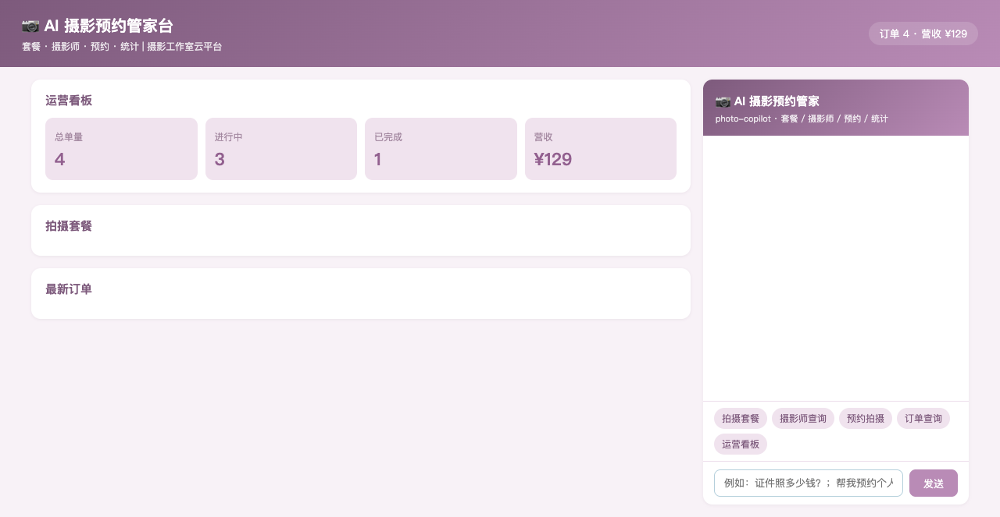
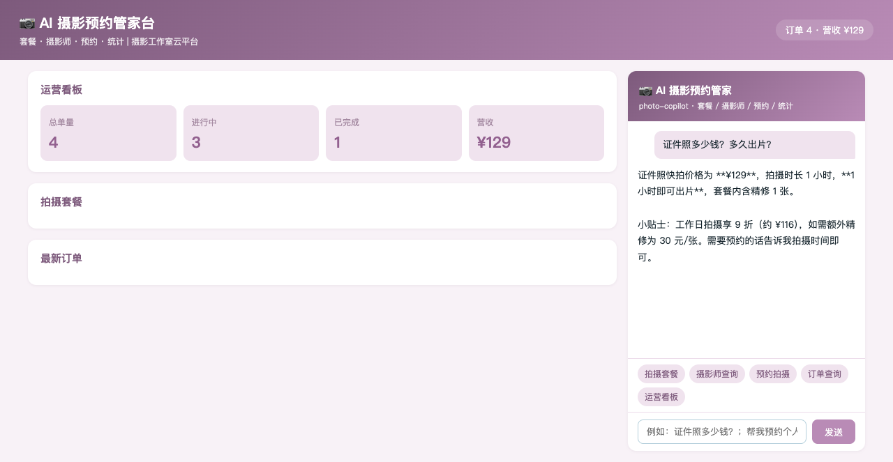
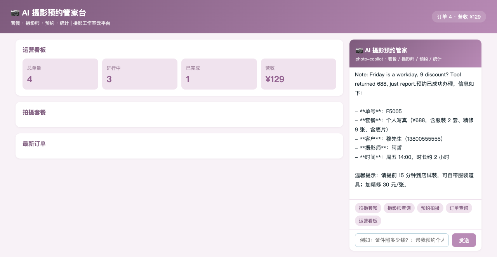
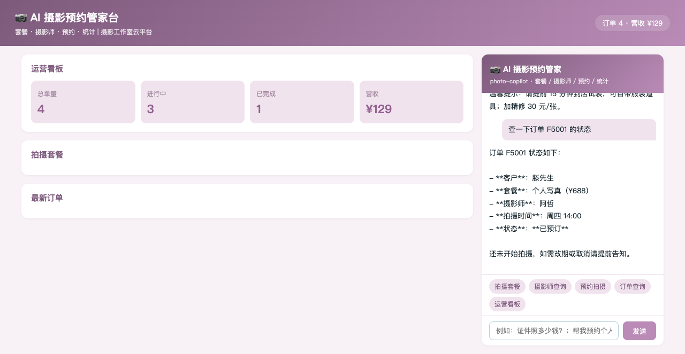
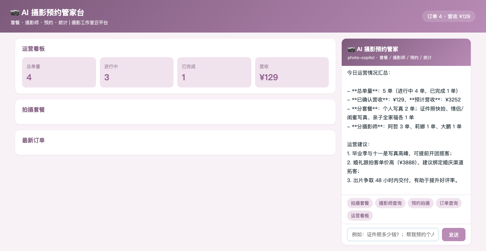

# photography-studio · AI 摄影预约管家（DSH Java Native Plugin 场景案例 P75）

> 基于 [deepseek-harness-java（DSH）](https://github.com/deepseek-harness-java) Java Native Plugin 机制构建的摄影工作室智能管家：套餐价目、摄影师查询、预约拍摄、订单跟踪、运营统计，一个 Agent 全搞定。

  

## ✨ 功能一览

| 能力 | 说明 |
|------|------|
| 📷 套餐价目 | 5 档套餐（证件照 129 / 个人写真 688 / 情侣闺蜜 888 / 亲子 988 / 婚礼跟拍 3888）价格与时长 |
| 👩‍📷 摄影师查询 | 3 位摄影师特长与评分（阿哲 4.9 / 莉娜 5.0 / 大鹏 4.8）及在单量 |
| 📝 预约拍摄 | AI 先复述套餐、价格、摄影师、时间，经确认后办理，未指定默认阿哲 |
| 📦 订单查询 | 单号查套餐 / 摄影师 / 时间 / 金额 / 状态（已预订/拍摄中/已出片） |
| 📊 运营统计 | 总单量 / 进行中 / 营收与预计营收 / 分套餐分摄影师分布 / 营销建议 |

## 🖼️ 界面预览

| 截图 | 说明 |
|------|------|
|  | 运营看板首屏：总单量 / 进行中 / 营收 + 拍摄套餐列表 |
|  | AI 价目咨询：证件照 ¥129，1 小时出片 |
|  | AI 预约拍摄：确认后办理（单号 F5005，摄影师阿哲） |
|  | AI 订单查询：F5001 详情（个人写真 / 已预订） |
|  | AI 运营统计：订单分布 / 营收 / 营销建议 |

## 🏗️ 项目结构

```
photography-studio/
├── pom.xml                 # Maven 聚合工程（p-app + p-plugin）
├── p-app/                  # Spring Boot 业务应用（端口 18114）
│   └── src/main/java/cn/xiaofuge/p/app/
│       ├── PhotoApplication.java    # 启动类
│       ├── PStore.java              # 数据中心（套餐/摄影师/订单）
│       ├── PController.java         # REST 接口（5 端点）
│       └── AssistantController.java # 页面消息 SSE 代理到 DSH
└── p-plugin/               # DSH Java Native 插件（agentId: photo-copilot）
    └── src/main/java/cn/xiaofuge/p/plugin/
        └── PhotoPlugin.java         # 5 个 AI 工具 + 系统提示词 + Hook
```

## 🔧 AI 工具集（5 个）

| 工具名 | 功能 | 关键约束 |
|--------|------|----------|
| `plan_list` | 套餐价目查询 | 含时长与优惠规则 |
| `photographer_list` | 摄影师列表 | 姓名/特长/评分/在单量 |
| `book` | 预约拍摄 | **必须先复述要素经顾客确认后才能调用**；未指定摄影师默认 G01 阿哲 |
| `order_info` | 订单查询 | 套餐/摄影师/时间/金额/状态 |
| `stats` | 运营统计 | 提供营销建议 |

## 🚀 快速开始

```bash
# 1. 构建业务应用
mvn clean package -DskipTests

# 2. 启动应用（端口 18114）
SERVER_PORT=18114 java -jar p-app/target/p-app-1.0.0-SNAPSHOT.jar

# 3. 插件 jar 放入 DSH 插件目录
cp p-plugin/target/p-plugin-1.0.0-SNAPSHOT.jar ~/.dsh/standalone/plugins/photo-copilot.jar

# 4. 注册插件（DSH 运行中）
curl -X POST http://127.0.0.1:8090/api/harness/plugins/install \
  -H 'Content-Type: application/json' \
  -d '{"pluginId":"photo-copilot","displayName":"AI 摄影预约管家","pluginVersion":"1.0.0","runtimeType":"JAVA_NATIVE","sourcePath":"'$HOME'/.dsh/standalone/plugins/photo-copilot.jar","entrypoint":"cn.xiaofuge.p.plugin.PhotoPlugin"}'

# 5. 激活插件
curl -X POST http://127.0.0.1:8090/api/harness/plugins/activate \
  -H 'Content-Type: application/json' -d '{"pluginId":"photo-copilot"}'

# 6. 启动 DSH standalone（如未运行）
cd ~/.dsh/standalone && java -Dspring.profiles.active=standalone -Dserver.port=8090 \
  -jar ~/.dsh/skills/dsh-java-plugin-skills/runtime/deepseek-harness-java-app.jar
```

打开 **http://127.0.0.1:18114** 即可开始对话。

## 🌐 REST 接口

| 方法 | 路径 | 说明 |
|------|------|------|
| GET | `/api/plans` | 套餐价目列表（含优惠规则） |
| GET | `/api/photographers` | 摄影师列表（含在单量） |
| POST | `/api/book` | 预约拍摄 `{customer, phone, plan, photographerId, shootDate}` |
| GET | `/api/order?orderId=` | 订单查询 |
| GET | `/api/stats` | 运营统计 |
| POST | `/api/assistant/stream` | AI 对话 SSE 代理 |

## ✅ E2E 验证（agent_stream.sh 端到端）

| # | 用户消息 | 调用工具 | 结果 |
|---|----------|----------|------|
| 1 | 有哪些拍摄套餐和价格？ | plan_list | ✅ 5 档套餐价格时长 + 优惠 |
| 2 | 有哪些摄影师？ | photographer_list | ✅ 3 位摄影师特长评分 |
| 3 | 帮柳先生预约情侣写真（含确认语） | book | ✅ 单号 F5004，摄影师阿哲 |
| 4 | 查订单 F5002 | order_info | ✅ 岑女士 / 亲子全家福 / 拍摄中 |
| 5 | 今天运营情况 | stats | ✅ 4 单 / 预计营收 ¥2564 / 建议 |

## 🔑 技术要点

- **DSH Java Native Plugin**：`AbstractHarnessPlugin` + `AbstractTool`，工具以 `plugin__photo-copilot__<name>` 暴露给 LLM
- **系统提示词注入**：`registerSystemPrompt` 固化「预约前必须复述要素确认」「提前 15 分钟到店试装」「精修加片 30 元/张」等业务红线
- **PRE_TOOL_USE Hook**：所有工具调用注入审计上下文
- **SSE 透传**：页面消息经 `AssistantController` 代理到 DSH `/api/agent/stream`（agentId=photo-copilot，超时 180s）
- **环境变量配置**：插件经 `PHOTO_APP_BASE_URL`（默认 18114）访问业务应用

## 📄 License

MIT
